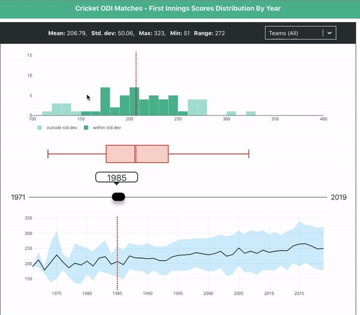

# Cricket Visualizations 

Collection of data visualizations and analysis related to Cricket game.

**Link**: [nowke.github.io/cricviz/](https://nowke.github.io/cricviz/)

## ODI Matches - First Innings Scores Distribution By Year



# Setup

**Install dependencies**

```sh
npm install
```

**Start the project**

```sh
npm run start
```

App will be running on [http://localhost:3000](http://localhost:3000)

**Building**

Creates minified JavaScript inside `build` folder

```sh
npm run build
```

**Publishing**

Publish to `gh-pages` branch

```sh
npm run deploy
```